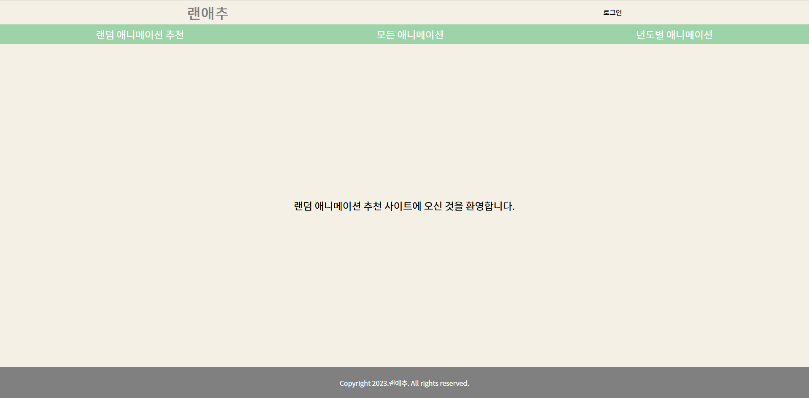
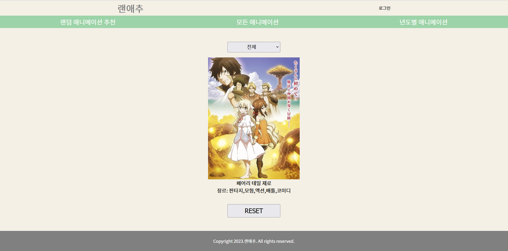
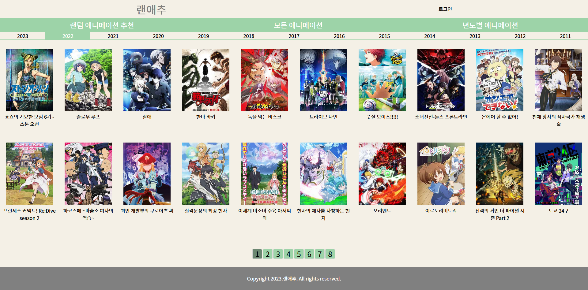
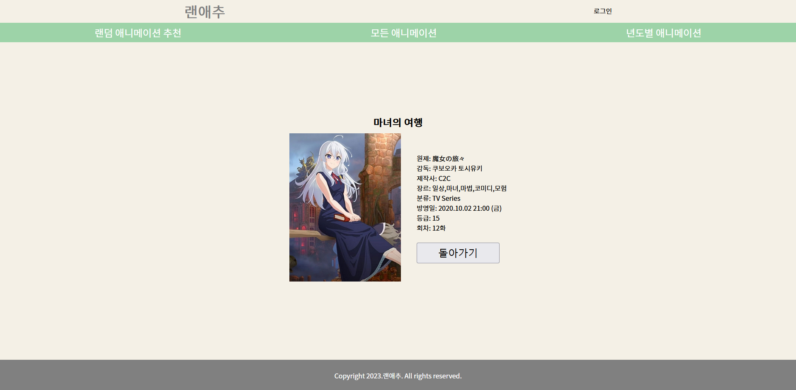
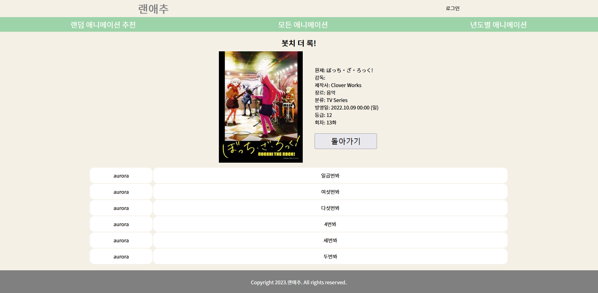
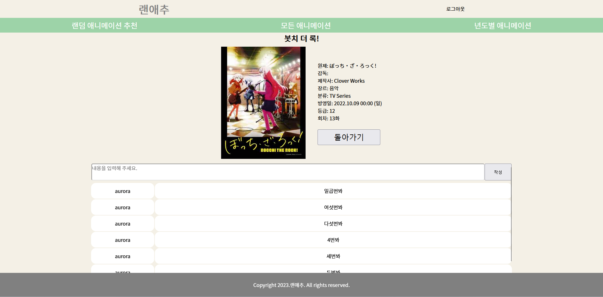
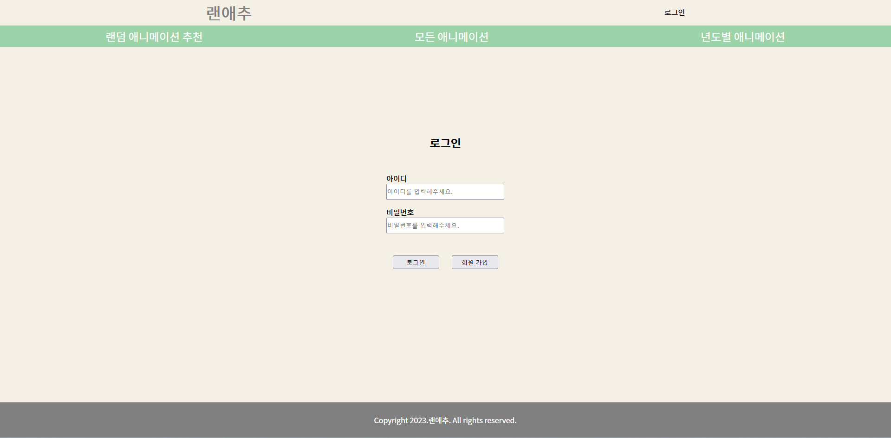
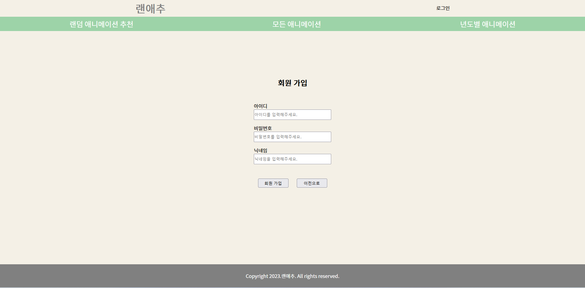

# 랜애추 프로젝트
http://www.randomanime.kro.kr

# ✨ 만들게 된 계기
> **친구의 요청으로 만들게 된 1인 프로젝트 
> 어떤 애니메이션을 볼지 고민하는 분들을 위해 랜덤으로 추천해주는 사이트를 만들게되었습니다.** 
> ※ 랜애추  = 랜덤 애니메이션 추천

# ⌛ 사전작업

- 애니메이션 사이트에서 Jsoup으로 애니메이션 정보 크롤링 
  https://github.com/SwAurora/AnimeCrawling

# 🔧 적용기술

- HTML, CSS, Javascript
- Java, Spring Boot
- Spring Data JPA
- Spring Security
- Thymeleaf
- H2 Database(테스트)
- MySQL
- GCP(배포)

# 📒 페이지 소개

### ✅ 메인 페이지

### ✅ 랜덤 애니메이션 추천 페이지

- 셀렉트박스로 장르를 선택해 장르별 랜덤 가능
- 썸네일을 클릭하면 해당 애니메이션 정보 페이지로 이동
- 하단의 리셋버튼으로 계속 조회

### ✅ 전체 애니메이션 페이지

- 전체 애니메이션 보기
- 썸네일을 클릭하면 해당 애니메이션 정보 페이지로 이동

### ✅ 년도별 애니메이션 페이지

- 년도별 애니메이션 보기
- 썸네일을 클릭하면 해당 애니메이션 정보 페이지로 이동
- 네비게이션바에서 년도 선택 가능

### ✅ 애니메이션 인포 페이지(리뷰X)

- 작성된 리뷰가 없는 애니메이션 인포 페이지
- 돌아가기 버튼을 누르면 이전 페이지로 돌아감

### ✅ 애니메이션 인포 페이지(리뷰O)

- 작성된 리뷰가 있는 애니메이션 인포 페이지

### ✅ 애니메이션 인포 페이지(로그인O, 리뷰O)

- 작성된 리뷰가 있고 로그인 된 상태인 인포 페이지
- 로그인한 유저만 리뷰를 작성 가능
- 돌아가기 버튼을 누르면 이전 페이지로 돌아감

### ✅ 로그인 페이지

### ✅ 회원가입 페이지
